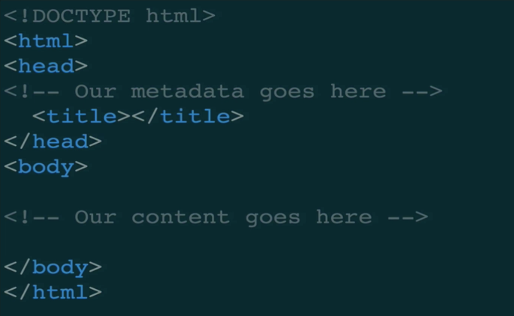

# 3. Introduction to HTML

## HTML Basics

* **The General Rule:** Tags are self-closing.
* `<tagName>Some Content</tagName>`
* Some tags are **block-level** tags \(content starts in a new line\) and others are **inline** tags \(content starts in the current line\).

## MDN \(Mozilla Developer Network\)

* A useful reference page.
* Contains reference, guide, introduction.

## HTML Boilerplate and Comments

* Every HTML document starts with this boilerplate 

* A shortcut for this template in Sublime: `html`+_tab_
* `<html>` tag
  * The _HTML_ tag represents the root element of an HTML document.
  * All other elements must be descendants of this element.
  * Permitted content: One `<head>`tag followed by one `<body>` tag.
* `<head>` tag
  * All metadata of the page goes in the _head_ tag.
* `<body>` tag
  * All actual content that shows up in the browser goes in the _body_ tag.
* `<title>` tag
  * The name of the page that shows up in the browser tab.
  * Used by searching engines.
* Comments
  * `<!--Comment content-->`
  * Shortcut for commenting in Sublime: _command_ + _/_.

## Basic Tags

* `<h1>` to `<h6>` tags
  * Heading elements
  * Different sizes
  * **Block-level elements**
* `
` tag
  * The paragraph tag
  * **Block-level** **element**
* `<b>` tag
  * Bold the content.
  * **Inline element**
* `<strong>` tag
  * Same effect as `<b>`
  * But with more actual structural meaning: strong
* `<i>` tag
  * Italicize the content
* `<em>` tag
  * Same effect as `<i>`
  * But with more actual structural meaning: emphasize
* Idea of introducing `<strong>` and `<em>` in HTML5
  * Separating structure from style \(since bold and italic themselves don't mean anything, only style\)
* `<ol>` tag
  * Ordered list
  * `<li>` for each element in the list
* `<ul>` tag
  * Unordered list
  * `<li>` for each element in the list

## Divs and Spans

* `
` tag
  * Generic container to **group content elements**.
  * Intensively used in styling by CSS.
  * Looks no differently from `
`.
  * **Block-level element**
* `` tag
  * Generic container to **group content elements**.
  * Intensively used in styling by CSS
  * **Inline element**

## HTML Attributes

* Adding additional information to tags
* Examples:
  * ``
  * `
woof woof
`
  * `<a href="www.google.com">Click me to go to Google</a>`
  * `<link rel="stylesheet" type="text/css href="style.css">`
* Reference: MDN HTML attributes
* Images
  * ``
  * **No closing tag**
* Links
  * `<a href="http://www.google.com">Click me to go to Google</a>`
  * Provides a link to some **url**. Need some content to click on.
  * **Inline element**
  * Pay attention to **file system protocol** and **HTTP protocol**.
  * Two types of path:
    * Relative path
    * Absolute path

